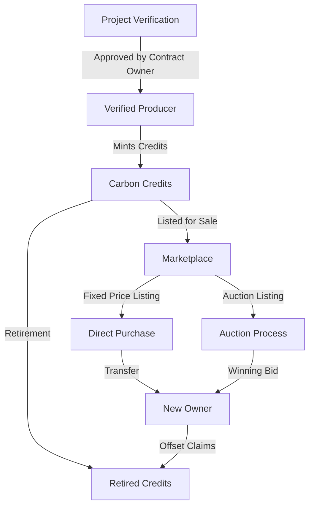

# CarbonMint - Carbon Credit Marketplace

A decentralized platform for transparent and efficient trading of verified carbon credits on the Stacks blockchain. CarbonMint enables direct connections between carbon credit producers and buyers while ensuring verifiable authenticity and preventing double-counting.

## Overview

CarbonMint revolutionizes the carbon credit market by providing:

- Transparent minting and trading of carbon credits as blockchain assets
- Direct marketplace connecting producers and buyers
- Verifiable tracking of credit origins and retirement status
- Multiple trading mechanisms including fixed-price listings and auctions
- Permanent and traceable retirement of carbon credits

Each carbon credit represents 1 ton of CO2 offset, backed by verified environmental projects like reforestation or renewable energy initiatives.

## Architecture



### Core Components

1. **Producer Verification System**
   - Contract owner verifies legitimate carbon credit producers
   - Stores project details and verification status

2. **Carbon Credit Registry**
   - Tracks credit ownership and metadata
   - Manages credit lifecycle from minting to retirement

3. **Trading Mechanisms**
   - Fixed-price marketplace listings
   - Time-based auctions with minimum bids
   - Direct transfers between parties

4. **Retirement System**
   - Permanent credit retirement for offset claims
   - Records beneficiary and retirement date

## Contract Documentation

### Carbon Marketplace Contract

The main contract (`carbon-marketplace.clar`) handles all core functionality:

#### Key Features

- Producer verification
- Carbon credit minting
- Marketplace listings
- Auction system
- Credit retirement
- Ownership tracking

#### Access Control

- Contract Owner: Can verify producers and transfer ownership
- Verified Producers: Can mint new credits
- Credit Owners: Can list, transfer, and retire credits
- General Users: Can purchase credits and participate in auctions

## Getting Started

### Prerequisites

- Clarinet installed for local development
- Stacks wallet for interacting with deployed contract

### Basic Usage

1. **Verifying a Producer**
```clarity
(contract-call? .carbon-marketplace verify-producer 
    producer-address 
    "Forest Project" 
    "Amazon Basin" 
    "Verification Authority Name")
```

2. **Minting Credits**
```clarity
(contract-call? .carbon-marketplace mint-carbon-credit 
    u100 
    "Reforestation Project" 
    "Forest Carbon" 
    "ipfs://metadata-hash")
```

3. **Listing Credits**
```clarity
(contract-call? .carbon-marketplace list-credit-for-sale 
    credit-id 
    price-in-stx)
```

## Function Reference

### Producer Management
- `verify-producer`: Register new carbon credit producers
- `get-producer-status`: Check producer verification status

### Credit Operations
- `mint-carbon-credit`: Create new carbon credits
- `transfer-credit-to`: Transfer credits between users
- `retire-credit`: Permanently retire credits for offset claims

### Marketplace Functions
- `list-credit-for-sale`: Create fixed-price listing
- `buy-credit`: Purchase listed credits
- `cancel-listing`: Remove marketplace listing

### Auction Functions
- `create-auction`: Start new credit auction
- `place-bid`: Bid on active auctions
- `finalize-auction`: Complete ended auctions

## Development

### Testing
Run tests using Clarinet:
```bash
clarinet test
```

### Local Development
1. Start Clarinet console:
```bash
clarinet console
```

2. Deploy contract:
```bash
clarinet deploy
```

## Security Considerations

### Key Safeguards
- Producer verification prevents unauthorized minting
- Ownership validation for all transfers
- Prevented double-spending of credits
- Credit retirement is permanent and irreversible

### Best Practices
- Verify producer credentials before interaction
- Check credit authenticity and source project
- Confirm credit retirement status before purchase
- Review auction terms and timeframes carefully